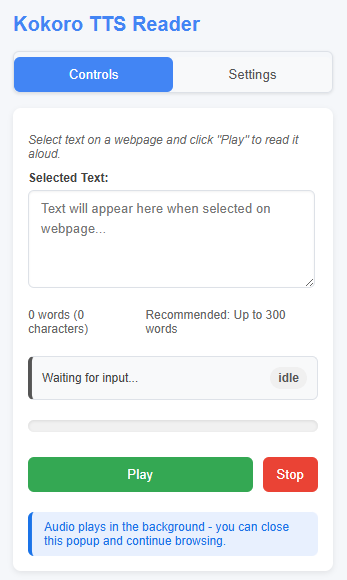

# Kokoro TTS Reader - Chrome Extension

A Chrome extension for text-to-speech using the Kokoro TTS API, allowing you to listen to any selected text on webpages with background audio playback.

## Overview

Kokoro TTS Reader is a Chrome extension that converts selected text from any webpage into speech using the Kokoro TTS API. Unlike typical TTS extensions, this one uses Chrome's Offscreen API to play audio in the background - meaning you can close the popup and continue browsing while listening.

**Note**: This is a fun experimental project that may contain bugs. Feel free to contribute fixes or report issues!

## Features

- **Background Audio Playback**: Continue browsing while listening to text
- **Context Menu Integration**: Right-click on any selected text to start reading
- **Word Counter**: Shows word count with recommendations for optimal performance
- **Progress Tracking**: Visual progress bar shows reading progress
- **Server Connection Testing**: Verify your Kokoro TTS server connection
- **Voice Customization**: Configure voice settings
- **Simple Controls**: Just Play and Stop - no complex controls

## How It Works

This extension uses Chrome's Offscreen Document API (introduced in Chrome 116) to play audio in the background without requiring a visible tab:

1. When you select text and press "Play" (or use the context menu), the extension:
   - Creates an invisible offscreen document
   - Analyzes and splits the text into manageable chunks
   - Sends chunks to the Kokoro TTS server
   - Plays the audio in the background

2. The extension includes a robust architecture:
   - **Background Script**: Manages the extension lifecycle and coordinates between UI and audio
   - **Offscreen Document**: Handles audio processing and playback in the background
   - **Content Script**: Captures selected text from webpages
   - **Popup UI**: Provides controls and displays status

3. Advanced features include:
   - Chunk-based processing for handling long texts
   - Audio preloading for smooth playback between chunks
   - Automatic cleanup to prevent resource leaks
   - Web Audio API for reliable audio handling

## Requirements

- Chrome browser (version 116+) - required for offscreen document API
- Kokoro TTS server (running on your local machine or accessible network)

## Installation

### From Source (Developer Mode)
1. Clone or download this repository
2. Open Chrome and navigate to `chrome://extensions/`
3. Enable "Developer mode" (toggle in the top-right corner)
4. Click "Load unpacked" and select the directory containing this extension
5. The extension icon should appear in your Chrome toolbar

## Usage

### Method 1: Context Menu
1. Select text on any webpage
2. Right-click the selected text
3. Choose "Read with Kokoro TTS" from the context menu
4. Text will be read aloud in the background

### Method 2: Popup Interface
1. Select text on any webpage
2. Click the Kokoro TTS Reader icon in your toolbar
3. The selected text will appear in the popup
4. Click "Play" to start reading
5. Click "Stop" to stop playback at any time

## Configuration

1. Click the extension icon to open the popup
2. Go to the "Settings" tab
3. Configure the following settings:
   - API URL: The URL of your Kokoro TTS server (default: http://localhost:8880)
   - API Key: Your API key if required (default: not-needed)
   - Voice: The voice ID to use (default: af_bella)
   - Chunk Size: The size of text chunks to process (options: 500, 1000, or 1500 characters)
4. Click "Save Settings" to apply your changes
5. Use "Test Connection" to verify the server connection

## Performance Tips

- For optimal performance, keep text selections under 2000 words
- Very long texts (5000+ words) may cause performance issues on low-end systems
- If you encounter issues with very long texts, consider splitting them into smaller sections
- Larger chunk sizes (1500) work well on higher-end systems but may cause delays on lower-end systems

## Troubleshooting

### Audio Issues
- If audio stops unexpectedly, click stop and try playing again
- Make sure your Kokoro TTS server is running and accessible
- Check the server URL in settings

### Connection Issues
- Verify the server URL and API key in settings
- Use the "Test Connection" button to check connectivity
- Ensure your Kokoro TTS server is running and accessible

### Browser Compatibility
- The extension requires Chrome 116 or newer due to use of the Offscreen Document API
- If you receive a browser compatibility message, update your Chrome to the latest version

## Known Limitations

- Maximum recommended text length is ~10,000 words for optimal performance
- Only one audio playback instance can be active at a time
- Some websites with strict Content Security Policy may block content script

## Technical Details

This extension uses:
- Chrome's Offscreen Document API for background audio playback
- Web Audio API for audio processing and playback
- JavaScript for core functionality
- Fetch API for server communication
- HTML/CSS for the user interface

## Credits

- Extension developed by [Your Name]
- Significant improvements and code enhancements by [Claude AI](https://claude.ai)
- Kokoro TTS model and server by [remsky](https://github.com/remsky)

## Future Plans

- Volume control
- Speed adjustment
- More voice options
- Better text processing for languages other than English
- Support for additional TTS engines

## License

[MIT License](LICENSE)

---

*This extension is not affiliated with Kokoro TTS. It is designed to work with any Kokoro TTS server.*
